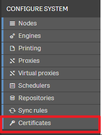
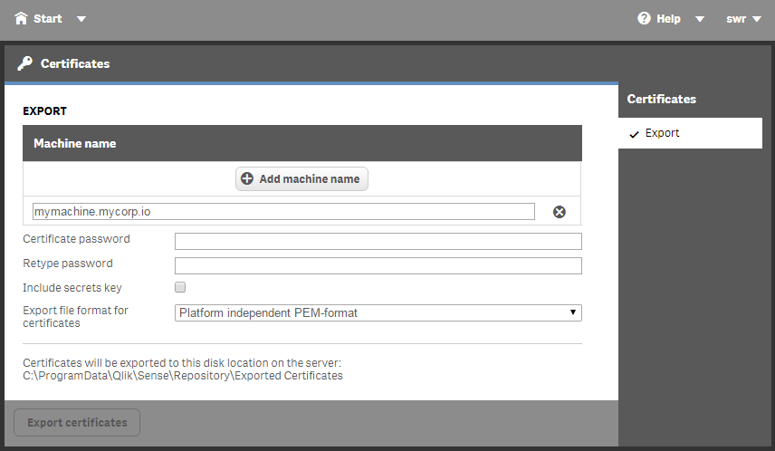
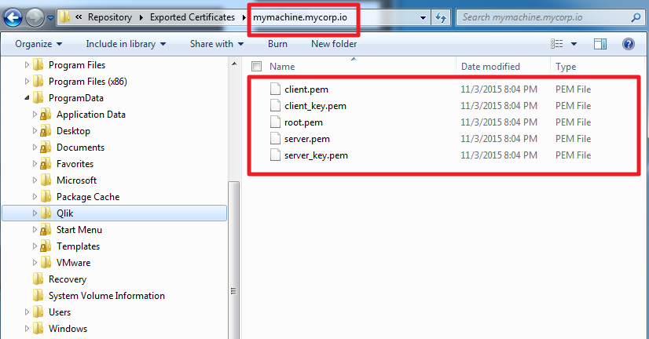
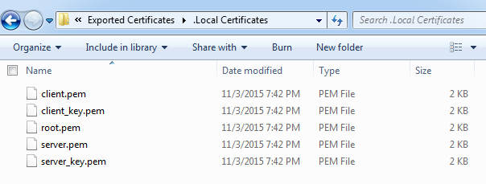

All services in Qlik Sense communicate using an SSL certificate. This certificate can also be used for several integration scenarios, for example to authenticate against the Qlik Sense Repository (QRS) API.

This article provides a step by step guide how to use certificates based on the [node.js library `qrs`](https://github.com/stefanwalther/qrs), based on Qlik Sense 2.1.1.

## Export the certificates
To be able to use the certificates in your solution you first have to export them. Therefore open the Qlik Management Console (QMC) using an account with the appropriate permissions.

**Step 1:**
Open Certificates in the left navigation panel under "Configure System":



**Step 2: Export the Certificate**

1. **Add a machine name** for the generated certificate. This is the full computer name of the machine the certificate is created for. This can be either a fully qualified name or an IP address.
2. The **certificate password** can be omitted if you don't want to change the certificate.
3. Include the **secret key**, if desired. In most integration scenarios like the current one, this is not necessary.
4. Finally select the **format for the certificate**. Since we are using node.js in this example, we choose the "Platform independent PEM format".
5. Click on "Export Certificates"



The certificates will be exported to the folder `C:\ProgramData\Qlik\Sense\Repository\Exported Certificates`. For every machine name you have added a new folder will be created.

## Copying the certificates

Connect to the server (e.g. using Remote Desktop), open the export folder, then you should find file files there:



For our integration scenario - talking to the Qlik Sense Repository (QRS) API using the node.js package `qrs` you just need the client files:

- client.pem - The client certificate
- client_key.pem- The client certificate key.
- root.pem - Root certificate

Copy these three files to the machine where your integration solution is running.

## Using the certificates in your solution

In case of the node.js package `qrs` you have to define the local path of these three files in the configuration object to the constructor of `qrs`:

```js
var QRS = require('qrs');
var config = {
    authentication: 'certificates',
    host: 'qlik-sense.mydomain.com',
    useSSL: true,
    cert: 'C:\\CertStore\\client.pem',
    key: 'C:\\CertStore\\client_key.pem',
    ca: 'C:\\CertStore\\root.pem',
    port: 4242,
    headerKey: 'X-Qlik-User',
    headerValue: 'UserDirectory:Internal;UserId:sa_repository'
};
var qrs = new QRS( config );
```

That's it. For other integration solutions, the procedure is very similar

## Using local certificates
If you are running a solution directly on the Qlik Sense server, there is no need to export the certificates. You can re-use some certificates which are immediately available after your installation. These certificates can be found under `C:\ProgramData\Qlik\Sense\Repository\Exported Certificates\.Local Certificates\`:


