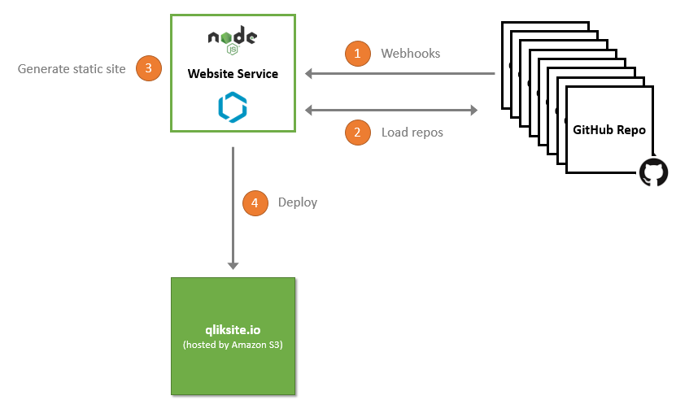

If you have been following my activities for a while, you might have realized that I have recently stopped to publish on [qlikblog.at](http://www.qlikblog.at) and moved over to a new site called [qliksite.io](http://qliksite.io).
Since then I have received some questions why I took this decision. qlikblog.at was and is quite popular, so on the first view this seems to be a stupid decision.
If you are interested to understand what happened, continue to read, otherwise **just enjoy the day**.

## qlikblog.at - So much 2000, äh WordPress

qlikblog.at is based on WordPress, which was fine and served my needs for some years. But over time I realized some problems:

- Actually I started to spend much more of my time in my favorite IDE, testing APIs, writing prototypes, documenting them a bit, [publishing them on GitHub](https://github.com/stefanwalther/). That kind of work really drives me, just experimenting what's possible with several APIs; that's fun.
    - But then the problem starts: Instead of just publishing the code and writing a README.md on GitHub I had to write about these projects a second time, just to publish them on my blog ... really boring. So I more and more ommited that work and focused on GitHub.
- I had new ideas how to publish and structure new content, but extending WordPress was hard. I am not really a big fan of PHP, therefore developing custom plugins annoyed me quite a lot, too much.
- Last but not least, I moved with my family from Austria to Germany, so a blog with a .at domain just felt wrong.

So all in all it was time to look for a new, a better solution.

## Just pure HTML?

Since I started to develop web-based solutions back in 1994 - in the very early days of the Internet - my obvious thinking was to maybe just develop my own system which fits my needs.
But then I read more and more about static-site-generators. And starting to test some of those system I started to re-think, this approach just felt natural to me:

- Just having again the full power and freedom of Html & CSS just felt great.
- It felt a bit retro, but good.
- But can a bigger web-site really work without a CMS, doesn't this lead sooner or later to a lot of broken links?
- How can I integrate all those GitHub repos in a nice way?

I spent more and more time to investigate which static-site-generator might be a good fit to meet my needs:

- [Jekyll](https://jekyllrb.com/) is great, but I am not a Ruby guy and also didn't want to investigate too much time to learn. 
- I wanted to have something available in the technologies I currently prefer: JavaScript and node.js
- So [metalsmith](https://github.com/metalsmith) was one of the next options, very nice and flexible, but it felt a bit limited. After writing a few plugins I realized that using metalsmith could result in a lot of coding work.
- Finally I ended up in following the great projects from [Jon Schlinkert](https://github.com/jonschlinkert) and [Brian Woodward](https://github.com/doowb), working on [verb](https://github.com/verbose/verb), [generate](https://github.com/generate) and especially [assemble](https://github.com/assemble/).
    - When starting to use assemble they main contributors just started a complete re-write, so I decided to follow closely.
    - It was hard to be patient (for over a year now) and wait until their complete re-write of these concepts finally took shape, but now we (or better said they) are there.
    
## Using assemble
The current version of qliksite.io uses assemble in the background, but even more: 

- It connects several GitHub repos and publishes them to a single site.

### The Flow

So how does that work:

- First of all I can continue to work on my prototypes, tutorials and projects and GitHub, just as I ever did in the recent years.
- I just use Markdown to comment these projects at the same time when I am working on them.
    - By doing so other developers can easily read the documentation on GitHub, can contribute, etc.
- But then the magic starts:
- My qliksite.io projects just picks up several repositories from GitHub/npm and generates static web-pages. During this process I can add some additional functionality which I am missing on GitHub pages (like special formatting, different structure for some content, etc.)
- Finally I just publish everything to an Amazon S3 bucket, all fully automated by using assemble & gulp. Just a single command line statement away: ```assemble deploy```.
- To even improve the system, I have added support for [Webhooks](https://developer.github.com/webhooks/), so if I make changes to a GitHub repo, my qliksite.io site generator running smoothly on digitalocean is informed, picks up the changes and re-generates the entire web site. Really neat ...



### Unbeatable Advantages

This approach introduces **some unbeatable advantages**:

- I can work on different GitHub repos, and don't have to invest any time on taking care of a nice publishing format, all is done automatically.
- I can stick to write all my articles in Markdown in actually every editor, offline on my iPad, while travelling, just without being dependent on any system ...
- As I open source all the base projects, I can also allow users on the web site to contribute, every page has a link to the original markdown file, people can just fork it and suggest improvements, correct errors live on GitHub, without even open a local IDE.
- All my content is available in two formats now:
    - The pure developer view on GitHub
    - A nicer and more structured format on qliksite.io
- The site is extremely fast (compared to WordPress) as I am just generating static HTML files, S3 does the rest by just being always available and fast - around the globe.
- Versioning? Yes, sure, certainly included. Just because of GitHub & git.
- Headaches because of a non available database, incompatible Wordpress version, etc.? Just gone, just HTML, CSS and a few files, that's it.

All in all I am just at the beginning, there is much more I want to get done:

- Bring all my projects onto a project page.
- Automate the process of promoting news to Twitter, Facebook, LinkedIn, Xing, etc.
- Take care of RSS-feeds, eMail-notifications, etc.
- Finetuning, finetuning, finetuning.
- Certainly making the system behind qliksite.io robust, generic and make it available to others.
- etc.    

What a fun new world. Finally the most important news for me: Due to the new system, I again enjoy publishing content, it just feels so good again. A bit retro, a bit back to the roots, but natural. 

> **Full power to the developer, not to the CMS.**

## Oh, I forgot ...

- Important to mention again: I am just sitting on shoulders of giants, thx [Jon](https://github.com/jonschlinkert) and [Brian](https://github.com/doowb) for working so hard and passionate on libraries like assemble, generate or verb. 
- Give this new world a try, e.g. by starting with some of the [assemble recipes](https://github.com/assemble/assemble-recipes/) I have published recently ;-) 
- Please don't ask, no I will not move over all the old stuff from qlikblog.at, just consider qlikblog.at to be a legacy web site.
- While writing I realize how much the new top level domain ***.io*** just reflects the new thinking: .io in the sense of input/output ;-)
