The Engine API Explorer has been introduced in Qlik Sense 2.1.1 but has been improved and face-lifted and improved in Qlik Sense 2.2

## Engine API Explorer, What?
The Engine Api Explorer is meant to be a useful tool to start understanding the Qlik Engine API, but also a nice little helper tool for your daily work with the Engine API.

### The Qlik Engine API
The Qlik Engine API is as Websocket protocol that uses JSON to pass information between the Qlik Engine (also sometimes called QIX engine) and clients. This API is the most important API used by the Qlik Sense client, but works completely independent of any platform and programming language. The only requirement is that the platform/programming language support Websocket communication.
More on the Qlik Engine API can be found in the [Qlik Sense Developer Help > Qlik Engine API](http://help.qlik.com/en-US/sense-developer/2.2/Subsystems/EngineAPI/Content/introducing-engine-API.htm)

### Where to find
The Engine API Explorer is one of the [Qlik Sense Dev Hub tools](http://help.qlik.com/en-US/sense-developer/2.2/Subsystems/Dev-Hub/Content/Overview/dev-hub-tools.htm), there are several ways to open it:

1) In the Qlik Sense Hub go to the menu and open "Dev Hub"
2) On Qlik Sense Desktop open `http://localhost:4848/dev-hub/`, then open "Engine API Explorer"
3) On Qlik Sense Server open `http://<server-name>/dev-hub/`, then open "Engine API Explorer"

## Let's start

Let's first discover the most important aspects fo the Engine API Explorer:

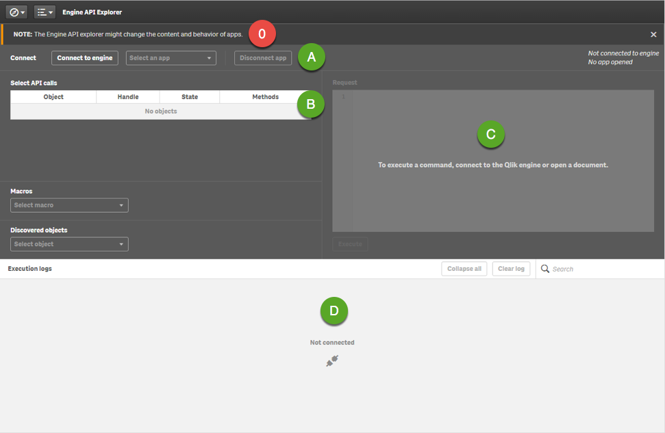

- `0` - Yes, be careful when using the Engine API Explorer. The Engine API Explorer allows you to perform changes to all apps, sheets, objects, etc. So when working with the Engine API Explorer make sure that you first backup your data or work on a copy of an app.
- `A`- By default the Engine API Explorer is not connected to an engine nor an app, but this is the region where you'll get the state of your current connection.
- `B` - If there is an active connection, this shows the possible API calls for each of the possible objects.
- `C` - When selecting a method, you'll see the command (as JSON request) in this area)
- `D` - After executing the command, you'll see the response from the Qlik Engine in this area.

## Basics

Let's discover some of the basic concepts, e.g. connecting to the Engine, getting a list of all existing apps and maybe just creating a new one.

### Connect to the Engine

First connect to the Engine:

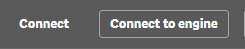

After doing so, you'll realize that the UI has updated:

First **there is now a global object**, representing the connection to the engine, with all methods available which can be executed against the current engine-connection:

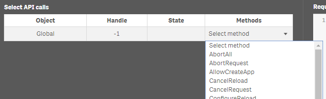

Then you'll realize that there is already one entry in the execution logs, which is "GetDocList", actually a request sent to the engine to fill the dropdown list "Select an app":

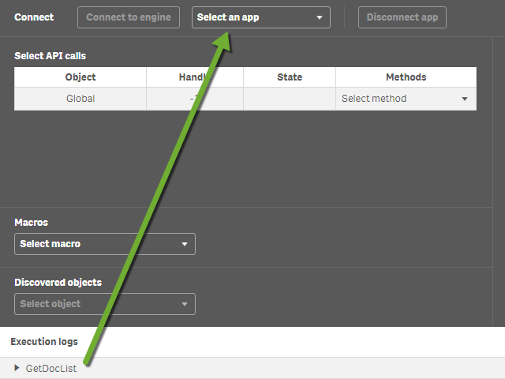

If you expand `GetDocList` in the "Execution logs", you can see what has been sent to the engine and what has been returned:

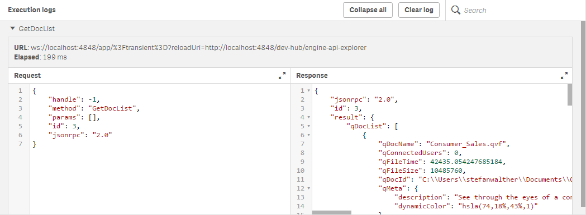

The response returns all details about the available apps (documents) in your environment. Use the expand icons to browse through the results in a more convenient manner:

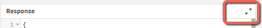

### Get document list

So just for a better understanding, let's clear the logs now and let's ask the engine for a list of current apps again:

**Clear the logs:**

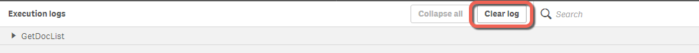

**
Select the method `GetDocList` in the list of available methods for the global object:

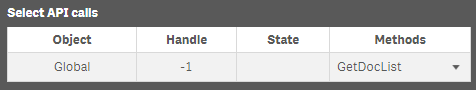

The "Request" field will be updated with corresponding JSON request:

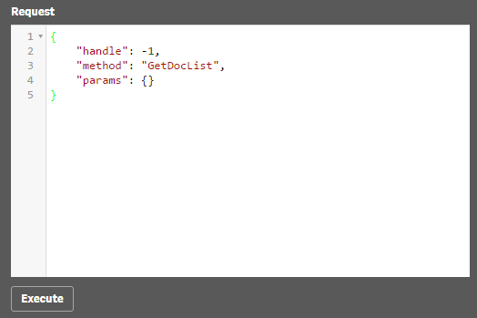

Press the now activated "Execute" button and watch the results (under "Execution logs"):

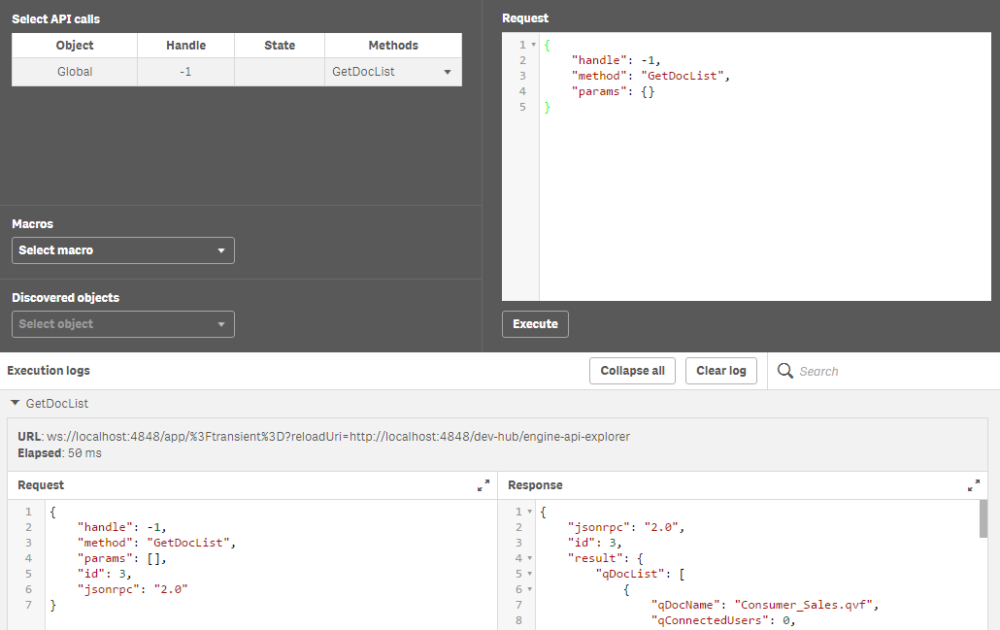

Yes, it's exactly the same as before. So, not really exciting so far, let's work on some more fun stuff.

### Create an app

Now let's create a completely new app, let's call it "Test-App". 

- `a` - First select the method `CreateApp` on the global object. You'll recognize that the "Request" field gets updated. The parameter `qAppName` is empty by default. 
- `b` - This is where we can define the name of the app, so let's fill in our `Test-App there:
- `c` - Finally send the request to the Engine

So what happened, do we have a new app called "Test-App" now?

The Execution logs give us the answer, yes, the app has been created successfully:

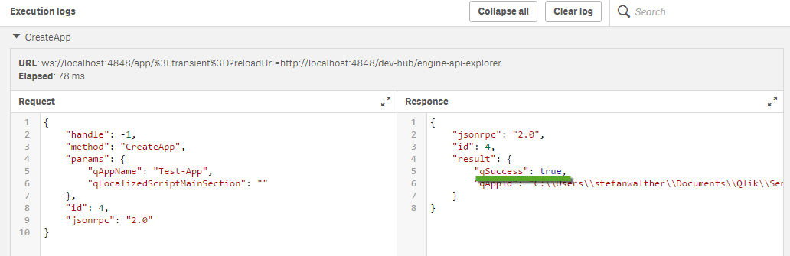

Hmmm, trust is good, control is better, let's execute a new `GetDocList`:

First you'll realize that all the previous commands are still available in the "Execution logs", our newly executed `GetDocList` is on top if you "Collapse all":

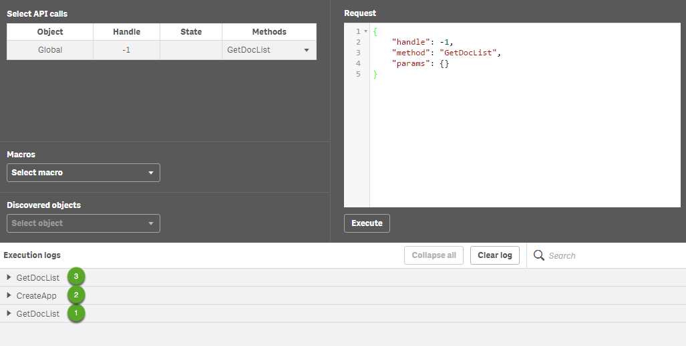

Expanding `GetDocList` (3) and scrolling down a bit confirms, that we have created a new app:

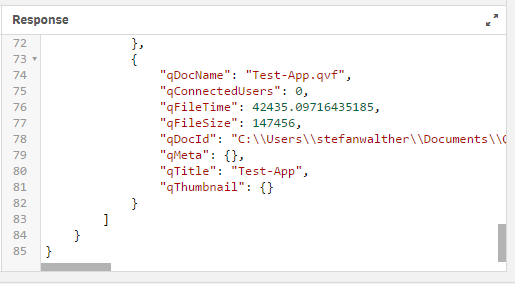

You still don't believe it? Then let's double-check on the Qlik Sense hub:

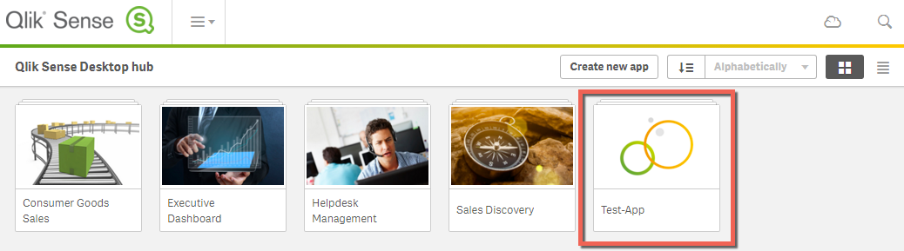

### Delete the app

As we now know that we have successfully created a new app, let's clean up our system again: We'd like to delete the app we have just created:

In the list of available methods on the global object, you'll find a method `DeleteApp`. Selecting this method changes the request as follows:

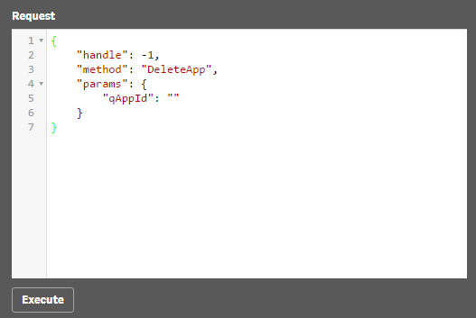

This is the default request, to delete `Test-App` we have to provide the `qAppId`, which is the unique Id of the previously created app. If you open again `GetDocList` in the *Execution Logs* and scroll to "Test-App", you'll find the unique Id listed as `qDocId`:

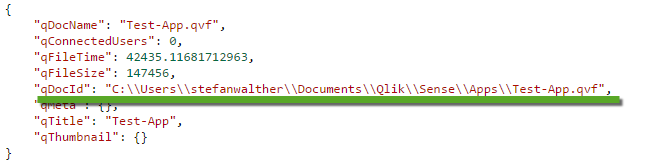

Copy the value (in my example starting with "C:\\Users...") and paste it into `qAppId`.

**Note:** 
In the given example I have worked using Qlik Sense Desktop, therefore the full path of the app is returned as Id, in case of using Qlik Sense Server you'd see a global unique identifier here.

Executing the request will then finally delete the app.

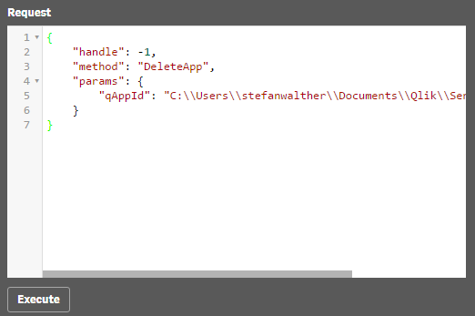

As you have already learned, how to double-check the result, I omit the screenshots to demonstrate the successful execution of our request.

## Summary

The Engine API Explorer allows you to start understanding the probably most important API of the Qlik Analytics Platform, the Engine API. We have just scratched the surface in this article, there is much more you can do with this neat tool. Stay tuned, more will be covered in future articles.
