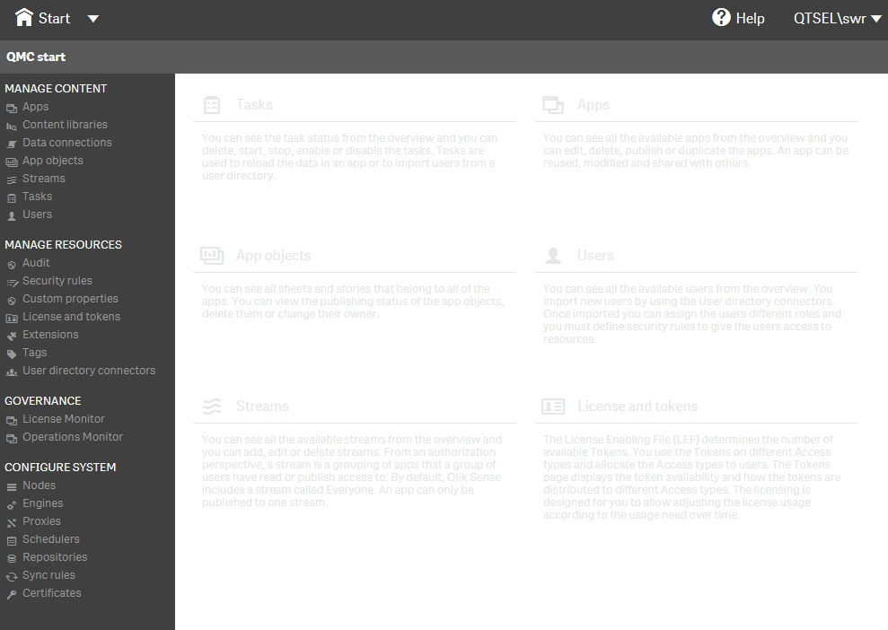
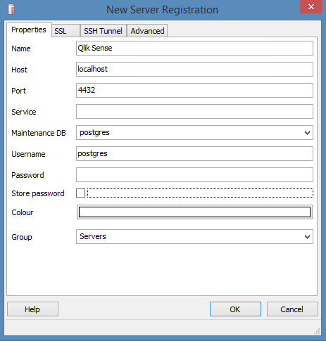
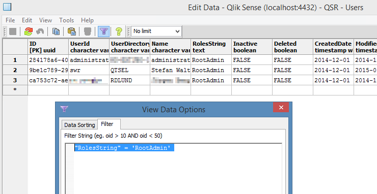
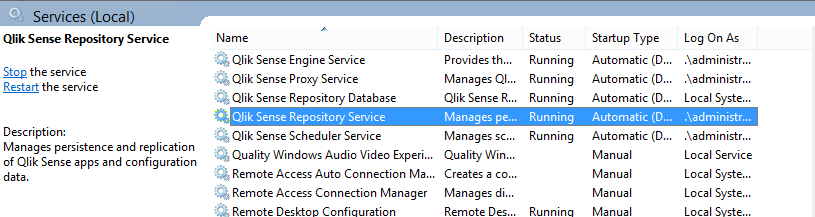

It should not happen, but it can: You don't have access to the RootAdmin which was used to set up Qlik Sense server.
This articles demonstrates how you can recover permissions to access Qlik Sense server again.

## Initial Situation

Hmmm, not really nice ....



Fortunately by modifying some entries in the PostgresSQL database, we can get access to QMC again:

## Step by Step Instructions

### 1) Use Remote desktop to connect to the server
### 2) Open pgAdmin tool**
One the server you'll find the pgAdmin tool located under  
`\Program Files\Qlik\Sense\Repository\PostgreSQL\9.3\bin\pgAdmin3.exe`  


Connect to the server using the following settings:  


  


### 3) Open the Users table
Go to

- `Databases` > `QSR` > `Schemas` > `public` > `Tables` and double click on the table `Users`
- right click on "View Data" > "View All Rows"

If you want to see the existing RootAdmins execute the following filter

```sql
"RolesString" = 'RootAdmin'
```



### 4) Make a user RootAdmin  

* Search for a specific user, the easiest way is again to add a filter:

```sql
"UserId" = `swr`
```

Then just add `RootAdmin` to the `RolesString` column.

### 5) Restart the repository service
Restart the Repository service and you are done.




### 6) The Result
You resp. the given user is now RootAdmin an can access all sections in QMC.
